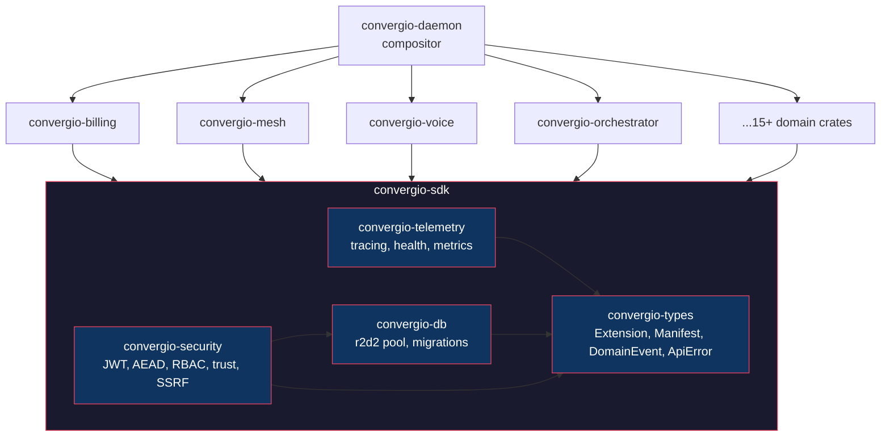

# convergio-sdk

[](https://github.com/Roberdan/convergio-sdk/actions/workflows/ci.yml)
[](https://github.com/Roberdan/convergio-sdk/actions/workflows/ci.yml)
[](https://github.com/Roberdan/convergio-sdk/blob/main/LICENSE)
[](https://www.rust-lang.org/)
[](#)
[](#)

Core SDK for the [Convergio](https://github.com/Roberdan/convergio) ecosystem.

## Architecture



## Crates

| Crate | Description | LOC | Tests |
|-------|-------------|-----|-------|
| [`convergio-types`](crates/convergio-types/) | Extension trait, Manifest, DomainEvent, ApiError | ~1200 | 14 |
| [`convergio-telemetry`](crates/convergio-telemetry/) | Tracing, metrics, health aggregation | ~370 | 9 |
| [`convergio-db`](crates/convergio-db/) | r2d2 + SQLite pool, migration runner, schema registry | ~480 | 14 |
| [`convergio-security`](crates/convergio-security/) | JWT, AEAD, RBAC, audit, trust, sandbox, SSRF | ~1550 | 51 |

**Total: ~3600 LOC, 88 tests (unit + integration + adversarial)**

## Quality gates

| Gate | Enforced by | Status |
|------|------------|--------|
| Zero warnings | `RUSTFLAGS="-Dwarnings"` | CI blocks merge |
| All tests pass | `cargo test --locked` | CI blocks merge |
| Adversarial security tests | `tests/adversarial_*.rs` | CI blocks merge |
| Dependency audit (CVE) | `cargo audit` | CI blocks merge |
| License + dependency policy | `cargo deny check` | CI blocks merge |
| Format | `cargo fmt --check` | CI blocks merge |
| Auto-release | release-please + PAT | Fully automatic |

## Usage

```toml
[dependencies]
convergio-types = { git = "https://github.com/Roberdan/convergio-sdk", tag = "v0.1.4" }
convergio-telemetry = { git = "https://github.com/Roberdan/convergio-sdk", tag = "v0.1.4" }
convergio-db = { git = "https://github.com/Roberdan/convergio-sdk", tag = "v0.1.4" }
convergio-security = { git = "https://github.com/Roberdan/convergio-sdk", tag = "v0.1.4" }
```

## Development

```bash
cargo fmt --all -- --check
RUSTFLAGS="-Dwarnings" cargo clippy --workspace --all-targets --locked
cargo test --workspace --locked
cargo deny check
```

## License

Convergio Community License v1.3 — see [LICENSE](LICENSE).

---

<!-- Copyright (c) 2026 Roberto D'Angelo. CC-BY-4.0. -->

## The Agentic Manifesto

*Human purpose. AI momentum.*
Milano — 23 June 2025

**What we believe**
1. **Intent is human, momentum is agent.**
2. **Impact must reach every mind and body.**
3. **Trust grows from transparent provenance.**
4. **Progress is judged by outcomes, not output.**

**How we act**
1. **Humans stay accountable for decisions and effects.**
2. **Agents amplify capability, never identity.**
3. **We design from the edge first: disability, language, connectivity.**
4. **Safety rails precede scale.**
5. **Learn in small loops, ship value early.**
6. **Bias is a bug—we detect, test, and fix continuously.**

*Signed in Milano, 23 June 2025 — Roberto D'Angelo · Claude · ChatGPT*

*Made with ❤️ for Mario in Milano, Italy, Europe.*
